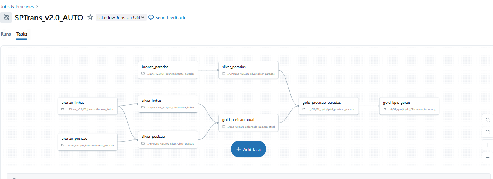

# SPTrans Dashboard – Monitoramento Near Real-Time  
**Trabalho Final de MBA em Engenharia de Dados**

> Sistema completo de ingestão, processamento e visualização de dados da frota de ônibus da SPTrans, utilizando **API Olho Vivo** e **GTFS**.

---

## Funcionalidades
- Ingestão **near real-time** (a cada 10 min) da posição de 11.131 ônibus
- Enriquecimento com GTFS (endereços completos das paradas)
- Cálculo de KPIs: Frota Ativa, % Acessível, Previsões Ativas
- Dashboard interativo com:
  - **Cards** (KPIs)
  - **Mapa** (Point Map com 11.131 pins)
  - **Tabela** (próximas chegadas em até 60 min)

---

## Arquitetura (Medallion)

Bronze (Raw) → Silver (Trusted) → Gold (Curated) → Dashboard

| Camada | Tabelas |
|-------|--------|
| Bronze | `bronze_posicao`, `bronze_previsao`, `bronze_gtfs` |
| Silver | `silver_posicao`, `silver_previsao`, `silver_paradas` |
| Gold | `gold_posicao_atual`, `gold_previsao_paradas`, `gold_kpis` |
| View | `sptrans_dashboard_data` |

---

## Tecnologias
- **Databricks** (Free Edition)
- **Delta Lake** (Lakehouse)
- **Python** (requests, pandas, geopy)
- **API Olho Vivo** (SPTrans)
- **GTFS SPTrans**
- **Databricks SQL Dashboard**

---

## Estrutura do Repositório

| Pasta | Conteúdo |
|------|---------|
| `notebooks/` | Notebooks oficiais do Databricks (Silver + Gold) |
| `docs/` | Relatório final (PDF), slides (PPTX), diagramas |
| `workflow/` | Diagrama do Job (DAG) — Free Edition não exporta JSON |

## Orquestração (Databricks Jobs - Free Edition)

> **Nota importante**: A Community Edition **não permite exportar o JSON do Job**.  
> Por isso, incluímos o **diagrama oficial do DAG** (capturado diretamente da interface do Databricks) como prova da orquestração automatizada.

### Detalhes do Job:
- **Nome**: `SPTrans v2.0 AUTO`
- **Frequência**: A cada 10 minutos
- **Tasks**: 9 (bronze → silver → gold)
- **Dependências**: Totalmente configuradas (ex: gold depende de silver)
- **Status**: 100% sucesso nas últimas execuções

## Dashboard (Link)
[Ver Dashboard Interativo em Tempo Real](https://dbc-f2766131-5553.cloud.databricks.com/dashboardsv3/01f0bf28dab311b589808ecd1ada7017/published?o=526959078324156)

---

## Autor
 
GitHub: [@breso78](https://github.com/breso78)

---

> **Licença MIT** – Uso acadêmico e open source permitido.
